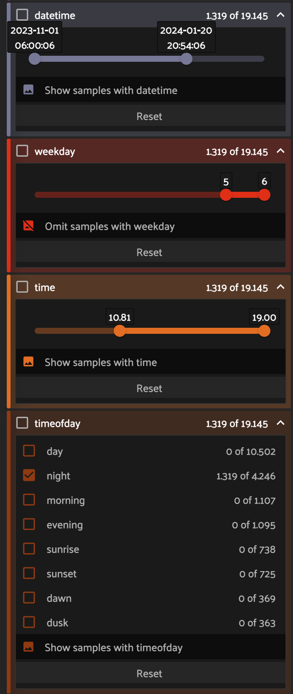

# FiftyOne Timestamps

This plugin provides operators to compute datetime related fields based on samples' `filepath` or `created_at` date.

This enables you to filter your dataset by:
- `datetime` time range
- `weekday` where **0** is monday and **6** is sunday
- `time` where **6.5** would be 6am and 19.0 would be 7pm
- `timeofday` based on provided geolocation can be one of **dawn, sunrise, morning, day, evening, sunset, dusk, night**



## Installation

```shell
fiftyone plugins download https://github.com/mmoollllee/fiftyone-timestamps/
```

## Python SDK

You can use the compute operators from the Python SDK!

```python
import fiftyone as fo
import fiftyone.operators as foo

dataset = fo.load_dataset("existing-dataset")

compute_timestamps = foo.get_operator("@mmoollllee/timestamps/compute_timestamps")

## Compute from filepath with custom regex pattern where filenames look like `image-2024-12-30_23-59-59.jpg`
compute_timestamps(dataset, source="filepath", regex=r".*([0-9]{4})-?([0-9]{2})-?([0-9]{2})_([0-9]{2})?-?([0-9]{2})?-?([0-9]{2})?.*?", timezone="Europe/Berlin")

## Compute from created_at
compute_timestamps(dataset, source="created_at", timezone="Europe/Berlin")

## If geo[lat, long] is set, `timeofday` will be computed with "sunrise", "dawn, "morning", "day", "evening", "sunset", "dusk", "night"
compute_timestamps(dataset, geo=[48.12345,9.12345], timezone="Europe/Berlin")
```

## ToDos
- [x] Implement `timeofday` field with Daytime / Nighttime / Morning / Evening by using [suntime](https://github.com/SatAgro/suntime)
